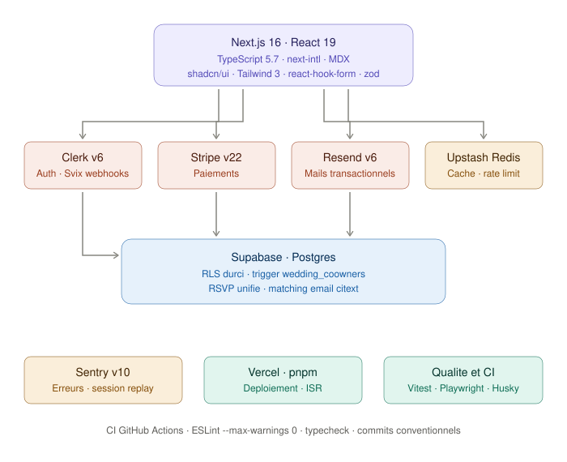

# Marryslate

SaaS de préparation de mariage : gestion des invités, RSVP, plan de table, budget, checklist et cagnotte.
En production sur [marryslate.com](https://marryslate.com).

## Architecture



**Front** Next.js 16 · React 19 · TypeScript strict · shadcn/ui · Tailwind · next-intl
**Data** Supabase Postgres · RLS durci · 21 migrations versionnées
**Services** Clerk v6 (auth, webhooks Svix) · Stripe · Resend · Upstash Redis
**Ops** Vercel · Sentry (erreurs + session replay) · GitHub Actions
**Qualité** Vitest · Playwright (dont tests a11y) · ESLint `--max-warnings 0` · husky + lint-staged + commitlint

## Choix techniques notables

- **Sécurité base** : RLS activé sur toutes les tables, `search_path` figé sur les fonctions, `EXECUTE` révoqué sur `PUBLIC`, copropriété de mariage gérée par trigger (`wedding_coowners`).
- **RSVP unifié** : matching des réponses par email en `citext`, avec statuts `matched`, `pending_validation`, `conflict` et `rejected` pour gérer les doublons et les invités inconnus.
- **Performance mobile** : LCP passé de 9,2 s à 2,2 s, score Lighthouse de 71 à 99.
- **Discipline de commit** : conventional commits imposés par hook, lint à zéro warning toléré, typecheck séparé du build.

## Commandes

```bash
pnpm dev          # serveur de développement
pnpm build        # build de production
pnpm lint         # eslint, zéro warning toléré
pnpm typecheck    # tsc --noEmit
pnpm test         # vitest
pnpm test:a11y    # playwright, tests d'accessibilité
```

## Statut

Projet personnel, développé et maintenu en solo.
